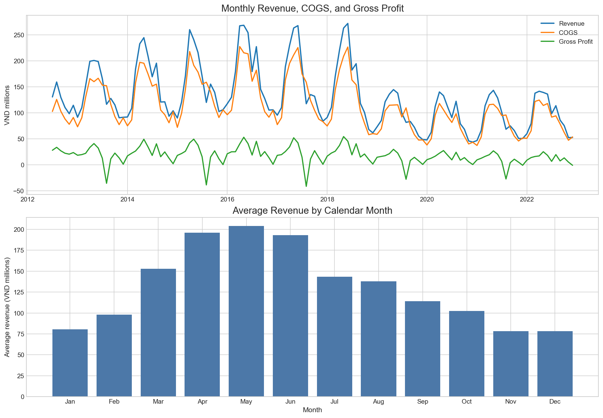
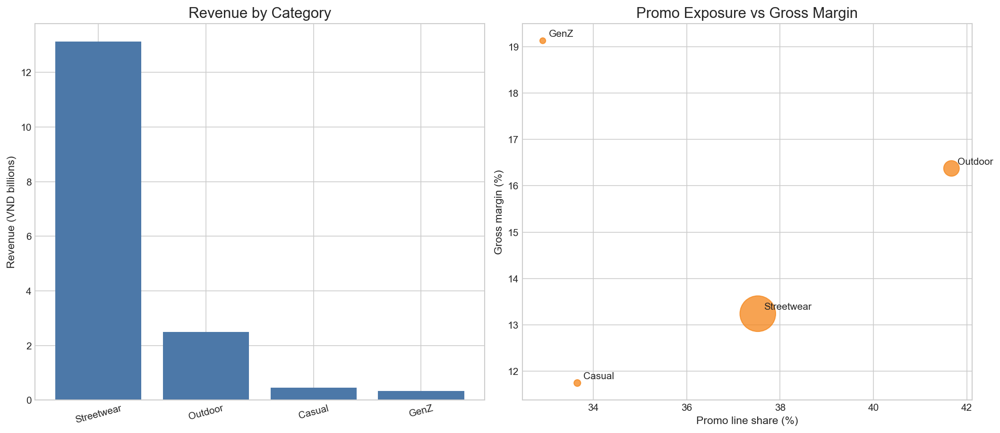
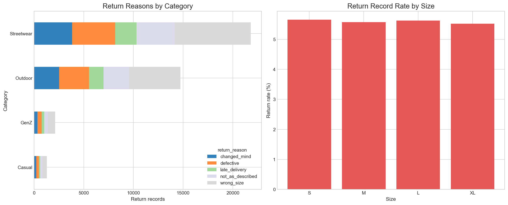
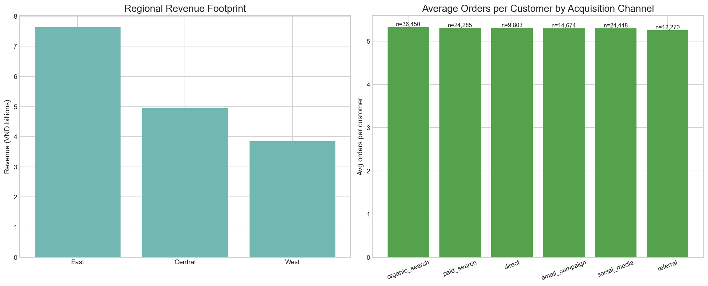
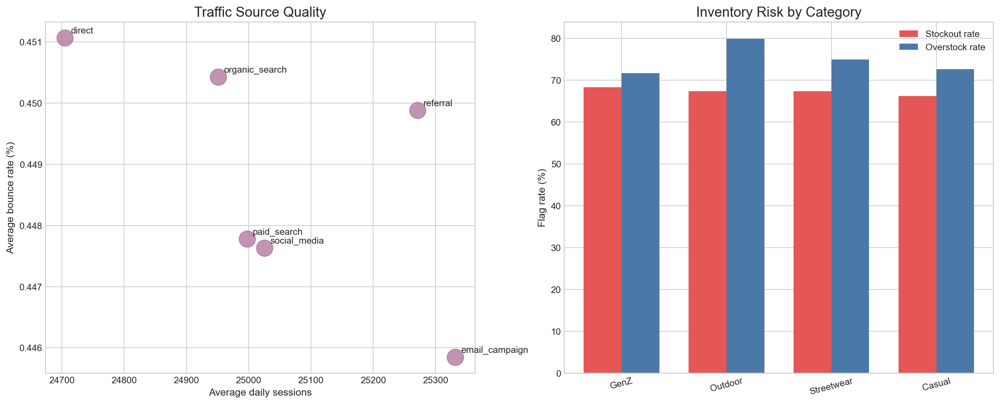

# Datathon Round 1 - EDA Report

This report focuses on business decisions that can improve revenue quality, reduce avoidable returns, and align inventory with demand.

## 1. Revenue is highly seasonal, with a concentrated peak in late spring to early summer

- Average monthly revenue peaks in **May** at roughly **203.84 million VND**, while **December** is the weakest month at about **78.25 million VND**.
- The trailing 12-month gross margin sits around **12.08%**, which means topline growth still depends on careful discount and cost control.
- Planning implication: inventory, staffing, and marketing should be front-loaded before the April-June peak window.

## 2. Streetwear is the engine of revenue, but not the engine of margin

- **Streetwear** is the dominant category with about **13.13 billion VND** in revenue.
- The strongest gross margin belongs to **GenZ** at roughly **19.13%**, while **Casual** is the weakest at about **11.75%**.
- Promo exposure does not automatically create healthy economics. The portfolio should protect margin in large categories before simply adding more discount volume.

## 3. Wrong size is the dominant driver of returns across the business

- The most frequent return reason is **wrong_size**, accounting for about **34.97%** of return records.
- Size **S** has the highest return record rate at roughly **5.65%**, but all sizes are close enough that the issue looks systemic rather than isolated to one size bucket.
- Action: invest in sizing accuracy first. Better size guides, fit notes, and size recommendation UX should reduce refund leakage faster than product-only interventions.

## 4. East brings the most revenue, but Central appears to hold stronger order value

- **East** generates the highest total revenue at about **7.64 billion VND**.
- **Central** has the highest average order value proxy at roughly **26758 VND per order**.
- On the customer side, **organic_search** brings the highest average orders per customer at around **5.33**.
- Action: defend East for scale, but use Central-style order composition as a benchmark for upsell and basket-building strategy.

## 5. The best traffic source is not necessarily the biggest one, and inventory shows chronic imbalance

- **email_campaign** has the lowest average bounce rate at about **0.446%**, which suggests higher visit quality than the rest of the channel mix.
- Daily sessions and daily revenue are positively related, but only moderately so, with a correlation of about **0.321**. Traffic quality matters, not just traffic volume.
- **GenZ** shows the highest stockout flag rate at roughly **68.29%**, while overstock remains high at **71.63%**.
- Action: inventory policy likely needs refinement. Simultaneously high stockout and overstock rates indicate assortment-level imbalance rather than total inventory shortage alone.

## Recommended submission framing

For the presentation deck or notebook, frame the story in four steps:

1. Revenue is seasonal and concentrated in a predictable peak window.
2. Scale is coming from categories that do not always have the best economics.
3. Returns are heavily driven by fit issues, which are fixable.
4. The company should shift from pure growth to growth quality: better sizing UX, smarter promo control, and region-aware inventory planning.
